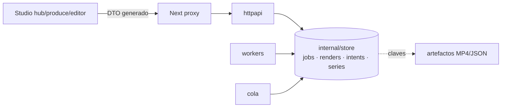

# Auditoría bottom-up: SQLite → API → Studio

Worktree `audit/data-architecture` sobre `main@6e0779f` (Studio 2.4.51). Solo lectura: no se ha ejecutado build, test, HLAE ni CS2.
Cada hallazgo cita `fichero:líneas` leídas. Los marcados **[verificado a mano]** los he releído yo además del scout.

## Veredicto corto

| Pregunta | Respuesta |
|---|---|
| ¿La BBDD está correcta? | **No como fuente de verdad.** `jobs.db` guarda 5 tablas sin `user_version`, sin FK, sin índices, y el estado que el usuario ve vive repartido entre la fila, `state.json` en disco, `generate-intent.json` y la cola en RAM. No hay concepto de usuario en ningún sitio. |
| ¿La API consume bien la BBDD? | **Parcialmente.** Lee la fila para gates, pero deriva el estado visible de ficheros; un GET muta `state.json`; hay borrados y encolados no atómicos; admisión con compensación solo en algunos POST. |
| ¿El frontend conecta bien con la API? | **No.** Tres vocabularios de estado (job / render / Video) con uniones incompletas, un campo de error mal nombrado en el GET de render, la Library es `localStorage` + latches en memoria, y el `RealApiClient` cae a mock para ids no-UUID. |

La causa raíz de las regresiones no es visual: **el estado de un reel se reconstruye en cada capa a partir de fuentes distintas**, y cada rediseño de UI reescribe esa reconstrucción. Persistir "por usuario" encima de esto congela el problema.

## Bloqueantes verificados

1. **`review_required` no existe para el sweep ni para Studio** [verificado a mano]
   - `cmd/zv-orchestrator/sweep.go:526-538`: `listAllDemoJobs` enumera 11 estados y omite `job.StatusReviewRequired` (`internal/job/job.go:42`). El worker sí lo escribe (`internal/workers/media_worker.go:983-984`) y los handlers permiten generate/render desde él (`handlers.go:1172`, `1391`).
   - Efecto: tras reiniciar, un render `queued|rendering` en `state.json` de un job `review_required` no se falla ni se limpia → Studio muestra un render activo sin worker.
   - `web/lib/api/jobs-index.ts:21-30` (`ROSTER_READY`) y `PLAN_READY_STATUSES` en `types.ts` omiten `review_required` → la partida desaparece de Partidas, `getMatch` devuelve null (`real.ts:303-305`), `findClips` devuelve `[]`.

2. **GET render emite `error`, el cliente lee `failure_reason`** [verificado a mano]
   - `internal/renderplan/render_variant.go:38` (`json:"error"`); `renderVariantResponse` (`handlers.go:1854-1858`) no añade `failure_reason`; `web/lib/api/real.ts:978,1014` lee `failure_reason`.
   - Efecto: todo fallo de render llega sin motivo; `requiresRecapture` (`failure-reason.ts`) nunca ve `recording_not_reusable:`. El test `real-mismatch-redrive.test.ts:234` fabrica `failure_reason`, así que la suite no puede detectarlo.

3. **Reel `ready` sin MP4 se queda congelado** [verificado a mano]
   - `real.ts:825-846`: se marca `ready` y solo se asigna `downloadUrl` si ya llegaron `artifactNames`; `reel-reconcile.ts:31-33` deja de reconciliar en cuanto `status === 'ready'`, y el hub (`clips/page.tsx` `anyoneWorking`) baja el poll a ralentí al no ver nada trabajando. El "next tick" nunca llega.

4. **`DeleteJob` borra con un render en curso** [verificado a mano]
   - `handlers.go:2180-2187`: solo `queued|scanning|parsing|recording|composing` cuentan como en vuelo. El render worker no cambia `job.Status`, así que un job `recorded|done` con `state.json=rendering` se borra (`2210-2218`: árbol primero, fila después) mientras el worker escribe.

5. **Proyectos del editor no se reconcilian al arrancar** [verificado a mano]
   - `startup_reconciliation.go:32-81` cubre demo, render, generate y stream; nada para `editor_projects`. `StartEditorRender` (`editor_handlers.go:416-424`) escribe `rendering` en fila y `renders/status.json` solo cuando la admisión es aceptada; si el proceso muere antes de que el worker termine, no hay sweep que lo devuelva a `draft`/`failed` y el siguiente POST responde 409 `already rendering` para siempre. (Un descarte en admisión devuelve `nil` y no toca la fila: ese caso no cuelga.)

6. **Unicidad de captura por hash del payload, no por job**
   - `handlers.go:1003` + `inline_queue.go:548-565`: `StartRecording` y `StartGenerate` con HUD/segmentos distintos encolan dos `record:demo` para el mismo job en el carril serie de CS2. Mismo payload → `ErrDuplicateTask` 202 sin `Begin` del intent (`handlers.go:1144-1148`): la UI cree que arrancó generate y solo corre la captura. Ya pasó una vez: `53dc00d`.

7. **Plan de stream y timeline del editor con doble verdad (columna + fichero)**
   - Stream: `sqlite_stream_repo.go:185-201` escribe columna, `stream_handlers.go:382,792` escribe fichero después; GET prefiere fila (`309-334`). Editor: `editor_handlers.go:328-362` idem; GET y worker leen solo la fila. Crash entre ambos → divergencia silenciosa; la huella de admisión del render puede no coincidir con lo guardado.

8. **Stream jobs y entidades del editor no tienen Delete** (`sqlite_stream_repo.go`, `sqlite_editor_repo.go`, `handlers.go:75-81`). Filas y árboles `stream-jobs/`, `editor-jobs/`, `editor-assets/` crecen para siempre.

## Cómo está repartida la verdad hoy

| Entidad | SQLite | Fichero | RAM | Quién decide lo que ve el usuario |
|---|---|---|---|---|
| Job demo | `jobs.data` JSON + columnas espejo `status/created/updated` | `jobs/<id>/**` | — | Columna para gates/orden; blob para el cuerpo (`sqlite_repo.go:227-235` vs `250-280`) |
| Kill plan | `job_kill_plans` (sin FK) | — | — | fila |
| Serie | `data.$.series_id` (json_extract, sin índice) | — | — | cliente agrega N jobs (`series-grouping.ts`); no hay agregado servidor |
| Progreso captura/render | — | `capture-progress.json`, dir de segmentos, `render-progress.json` | — | ficheros (`progress.go:36-51`); `ListJobs` nunca lo adjunta |
| Estado de render por variante | — | `renders/<variant>/state.json` | `renderStateMu` | fichero; **GET lo muta** (`handlers.go:1696-1807`) |
| Generate intent | — | `generate-intent.json` | 64 mutex | fichero |
| Cola / unicidad / reintentos | — | — | `inlineQueue` | RAM; tras reinicio solo sobrevive lo que el sweep repare |
| Stream edit plan | `stream_jobs.edit_plan` | `edit-plan.json` | — | ambos |
| Editor timeline | `editor_projects.plan_json` | `timeline.json` | — | fila |
| Reel de la Library | — | — | `localStorage cliphub.reels.v1` (cap 50) + `reels`, `artifactNames`, `driveLatch` | **el navegador** (`reel-store.ts:39-43`, `real.ts:172-197`) |
| Portada elegida | — | — | localStorage | navegador (`real.ts:630-651`) |
| Borrador de stream | col + fichero | — | `localStorage cliphub.stream-draft.{jobId}` | navegador |
| Cuenta Steam / FACEIT followed | — | `steam/account.json`, `faceit/followed.json` (singletons globales) | — | fichero |

Cuatro dueños distintos para "¿está listo este reel?". Ese es el bug estructural.

## Deriva de contratos entre capas

- **Enums de estado**: Go job (12 strings, `job.go:45-58`), render (5, `render_variant.go:13-18`), stream (6), editor (4), TS `VideoStatus` (6). Las mismas palabras (`ready`, `failed`, `rendering`) significan máquinas distintas. Ninguna unión TS está generada desde Go.
- **Campos que desaparecen en silencio**: `failure_code` no llega al cliente (`web/app/api/demos/_local.ts:74-88` lo filtra); `overlay_theme` se pierde en POST render (`handlers.go:1269-1363`, `renderEditRequest` no lo tiene); `keydrop_start/end_seconds` se pierden en hidratación (`render-hydration.ts:47-93`); `map.ts:95-129` inventa `playedAt = now()`, `score = ''`.
- **Fugas en sentido contrario**: proxies de streams y editor reenvían `source_path` y `media_key` al navegador (`streams/route.ts:87-91`, `mediaassets/types.go:41-51`).
- **Mock dentro del cliente real**: `real.ts:264,300,345,380,461` delega a `MockApiClient` para ids no-UUID; el mock pasa a `ready` en 10 s con un MP4 de muestra (`mock.ts:219-237`). Un componente funciona en fixtures y rompe en producción.
- **Errores**: Go devuelve `{error: string}` salvo un puñado de `code`; `503 {code: service_unavailable}` es contrato del proxy Next (`_lib.ts:74-79`), no de Go, que usa 503 para "no configurado" (FACEIT/Steam/session). El cliente ha acabado grepeando texto en español (`cd0a4cd`, `21fb958`, `1f4d673`).
- **Paginación**: Partidas pide `limit=100` (`_lib.ts:104-110`), tope duro del servidor (`handlers.go:476-490`). La partida 101 desaparece sin aviso.

## Paridad memory vs SQLite (por qué los tests no protegen producción)

`ZV_DATABASE_URL=memory` sigue siendo un modo (capture lab) y los tests de handlers usan `fakeRepo` que **aliasa** punteros (`handlers_test.go:202-211`). Divergencias con efecto:

| Método | Memory | SQLite |
|---|---|---|
| `GetStatus.failure_reason` | siempre | solo si `status=failed` |
| `ListByStatus` | sin orden, **conserva KillPlan** | ordenado, sin plan |
| `Create` con id repetido | sobreescribe | error UNIQUE |
| `Get/GetMeta` | comparte slices (`Rules.Weapons`, `Segments`) | copia fresca |
| Editor `List` vacío | `[]` | `null` |

Sin `sqlite_editor_repo_test.go`. Memory job tests no cubren `GetStatus`/`ListByStatus`/clone.

## Historial: qué se rompe una y otra vez

150 commits `fix` desde junio; 48 en cola/worker, 42 en UI, 12 en `web/lib/api`, 10 en handlers, 8 en SQLite. Ficheros más parcheados en los últimos 40 fixes: `web/lib/api/real.ts` (8), `internal/workers/media_worker.go` (8), `web/lib/full-demo.ts` (7), `internal/httpapi/handlers.go` (6), `web/lib/api/types.ts` (5).

`014b91f` (hub, 144 ficheros) necesitó `9ca10b9` al día siguiente para: `scanned` tratado como parsing, snapshot parcial que vaciaba la lista, reconcile que re-lanzaba generate en cada mismatch, cap de 300 polls que declaraba fallido un render vivo, autosave silencioso, y `segment_ids` que no existía en el task Go. Patrón: **cutover de UI sin extender el contrato de la fila**, arreglado con parche simultáneo Go+web.

Clases recurrentes con evidencia: deriva TS/Go (`9ca10b9`, `0b78339`, `cd0a4cd`); estado UI desde dos fuentes (`0b78339`, `b4e454c`, `6212254`); esquema evolucionado con `PRAGMA table_info`+`ALTER` (`21fb958`, `b9b21f4`); carreras de unicidad en cola (`53dc00d`, cluster de julio); refactor que suelta callsites (`014b91f`, `a2ffde1`, `ad19fb9`); bucles de poll/reconcile (`328cd6f`, `a4caea2`); código HTTP mostrado como estado de dominio (`1f4d673`, `55328c1`, `661fedc`).

## Arquitectura objetivo

Principio: **la fila es la verdad; los ficheros son artefactos direccionados desde la fila; el navegador es caché**.

1. **Un paquete `internal/store`** que absorba `sqlite_repo.go`, `sqlite_stream_repo.go`, `sqlite_editor_repo.go`, `memory_*`, `sweep.go`, `startup_reconciliation.go` (seam ya aceptado en `internal/AGENTS.md:51`). Migraciones numeradas con `PRAGMA user_version` (plantilla: `internal/telemetry/store.go:60-151`), `foreign_keys=ON`, `job_kill_plans.job_id REFERENCES jobs ON DELETE CASCADE`, `UNIQUE(editor_assets.sha256)`, índices `(status, updated_at DESC)` y `series_id`.
2. **Tabla `render_variants`** (`job_id, variant, status, revision, error, warnings, artifact_prefix, updated_at`) que sustituya `state.json` como verdad; el fichero queda como salida del worker. Con eso `GetRenderVariant` deja de escribir, `DeleteJob` puede consultar "render activo" en la misma transacción, y el sweep es un `UPDATE ... WHERE status IN (queued, rendering)`.
3. **Tabla `generate_intents`** (o columna en `render_variants`) en vez de `generate-intent.json`. Misma razón.
4. **Un solo `status` por entidad en un solo enum Go**, y el DTO TS **generado** desde Go (un `go generate` que emita `web/lib/api/generated.ts` con uniones y structs; test que falla si el fichero no está al día). Elimina la clase de regresión nº 1 del historial.
5. **Admisión atómica**: todo POST que encola pasa por `EnqueueWithTransition` con compensación en `context.Background()`; clave de unicidad = `(job_id, stage)`, nunca el payload. `StartRecording`, `StartComposition`, anticheat y editor hoy no cumplen.
6. **Un solo endpoint de estado**: `GET /api/jobs/{id}` devuelve fila + `render_variants` + progreso + `failure_code`; `GET /api/jobs` devuelve el mismo DTO reducido, con cursor. El cliente deja de componer tres GETs y un latch.
7. **Library en servidor**: `reel_intents` (`id, job_id, variant, edit_config, selected_cover, created_at`) sustituye `cliphub.reels.v1`. Hoy la Library del usuario vive en el perfil de Chromium de Electron: es lo primero que se pierde y lo que "por usuario" realmente pide.
8. **Cliente**: eliminar el fallback a mock del `RealApiClient` (modo demo explícito), borrar `map.ts` en favor del DTO generado, y hacer que `reconcile` sea idempotente por `(job_id, revision)` y no pare hasta tener `downloadUrl` o un `failure_code` terminal.

### Sobre "persistencia por usuario"

Hoy no hay `user_id` en ninguna tabla ni prefijo de artefacto, y `steam/account.json` / `faceit/followed.json` son singletons con secretos. Dos opciones, con distinta deuda:

- **A. Un `ZV_DATA_DIR` por usuario** (perfil de Windows o perfil elegido en Studio). Esquema sigue single-tenant; el lease (`data_dir_lease.go`) y `sqlitePath` (`config.go:66-71`, hoy puede escapar del DataDir) pasan a estar anclados al perfil. Coste bajo; aísla también secretos y artefactos. **Recomendada** mientras Studio sea local.
- **B. `owner_id` en cada tabla y prefijo `users/<id>/` en artefactos.** Obliga a tocar todas las claves de `internal/artifacts`, `streamclips/artifacts.go`, `timelineplan/keys.go`, `mediaassets`, y a filtrar en cada `List`. Solo tiene sentido si un mismo DataDir va a servir a varios usuarios a la vez.

En ambos casos, los puntos 1-7 van **antes**: añadir usuario sobre una verdad repartida multiplica los sitios donde puede divergir.

## Plan por fases (cada fase deja `main` mejor y es verificable sola)

Estado en esta rama (`audit/data-architecture`): **hecho** = implementado con tests en esta rama; **pendiente** = requiere decisión de producto o esquema.

| Fase | Contenido | Estado |
|---|---|---|
| 0. Sangrado | `job.Statuses()` + `JOB_STATUSES` como catálogo único (sweep y sets TS derivan de él); `fetchRenderStatus` lee `error`; reconcile sigue hasta `downloadUrl`; `DeleteJob` refusa con render/generate activo (409 `generate_work_active`); sweep + compensación de descarte para proyectos del editor; `failure_code` llega al cliente. | hecho |
| 1. `internal/store` | Repos movidos a `internal/store` (`OpenSQLite`/`NewMemory`), sweeps a `internal/reconcile`; migraciones `user_version` (v1 baseline, v2 FK `job_kill_plans → jobs ON DELETE CASCADE`, `foreign_keys=ON`, índices para cada `ORDER BY`/`WHERE`, drop de `jobs.kill_plan`); `Delete` para stream jobs, proyectos y assets del editor (API, proxy, cliente y fila de la lista de streams); `contract_test.go` memory vs sqlite que expuso y corrigió `GetStatus`, `ListByStatus`, aliasing y `Create` duplicado. | hecho (la cola inline sigue en `cmd`) |
| 2. Verdad en la fila | Unicidad de cola por `tasks.UniqueScope` (job / job+variante) en vez de hash del payload; admisión atómica con reclamo en fila y compensación de descarte para `record`, `compose`, anticheat y editor; materialización de estados de render legacy en el arranque (`MaterializeRenderVariantStates`) para que el GET sea lectura en régimen estacionario. | parcial: `render_variants`/`generate_intents` como tablas y la retirada de `edit-plan.json`/`timeline.json` siguen pendientes |
| 3. Contrato | `code` en todo 4xx/5xx de Go (`service_unavailable` reservado al proxy; 503 de Go se reenvía con su `code`); proxies de streams y editor con proyección explícita (`public-projections.ts`); `overlay_theme` y tiempos de KeyDrop sobreviven el round-trip; `RealApiClient` sin fallback a mock. | parcial: el DTO TS generado desde Go y el índice con cursor siguen pendientes |
| 4. Library servidor + usuario | `reel_intents` + cover en servidor; DataDir por perfil. | pendiente: decisión de producto (opción A vs B) |

## Riesgos y lo que no se ha probado

- Nada se ha ejecutado: ni HLAE/CS2, ni renders, ni suites. Los bloqueantes 1-5 están verificados por lectura de código; 6-8 por el scout con citas.
- `ZV_DATABASE_URL=memory` en producción: si solo lo usa capture lab, la paridad memory/sqlite baja de WARNING a deuda de tests.
- `listPlanReadyMatches` no tiene llamador en `web/app`/`web/components`: candidato a borrar.
- Rutas Go sin proxy Studio (`/moments`, `/compose`, `/final`, `/quality`, `/pack`, `/gallery`, `/revisions/*`, `/loadouts`, `/stream-variants`, `/voice-profiles`): decidir si son CLI-only o superficie muerta antes de mover repos.

Informes por capa con todas las citas: `docs/audit/db.md`, `docs/audit/api.md`, `docs/audit/web.md`, `docs/audit/history.md`.
