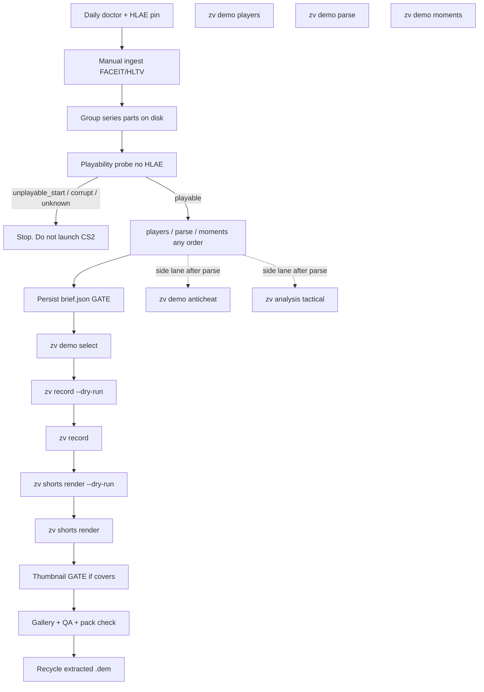
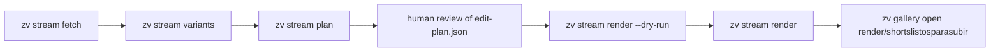

# CLI-First ClipHub Operator Workflow

| Field | Value |
| --- | --- |
| Title | CLI-first ClipHub operator workflow (no desktop app) |
| Author | (design; not yet assigned) |
| Date | 2026-08-14 |
| Status | Draft (revised 2026-08-14; Q1/Q2 answered) |
| Audience | Operator of this Windows box + engineers extending `zv` |
| Scope | Process + thin tooling around the existing unified CLI. Studio / Electron / Next.js stay in the tree; they are not on the path. |

---

## Overview

ClipHub already has a complete Windows-local pipeline behind `.\bin\zv.exe`. Studio is a GUI over that pipeline, not a prerequisite. This design makes the operator loop **CLI-only**: one run directory, explicit HLAE pin, a cheap playability screen before any CS2 launch, human gates as persisted files, and a PowerShell/`cmd.exe` cookbook that does not trip `--`.

The default path is the **staged demo flow** from `zv flows show demo`, with a cheap probe inserted after ingest and **before** any CS2 launch:

`doctor → ingest → group parts → probe → players / parse / moments (any order) → creative brief → select → capture → shorts render → thumbnail/QA`.

Probe is serial and HLAE-free. `players` / `parse` / `moments` may run in any order **after** probe has classified `playable`, or after the operator has already stopped on an unplayable part and is only mining kill JSON.

`zv short` / `zv workflows run short` is the fast path **only** when the SteamID64 and selection policy are already complete **and** the demo is classified playable. It is not the daily driver for unknown rosters, HLTV parts, or FACEIT second halves.

This is not a request to delete `web/` or `desktop/`. It is a request to stop depending on `zv serve`, the Next proxy, and the `X-ClipHub-Token` surface for production work.

---

## Background & Motivation

### Current state

The product contract is already CLI-first (`CLAUDE.md`, `.codex/GUIDE.md`, `cmd/zv/flow_commands.go`):

```text
.dem -> parse/score -> selected kill plan -> HLAE/CS2 capture -> FFmpeg/Lua render -> publish pack
stream video -> persisted edit plan -> render -> publish pack
```

Studio (`zv serve` + Next + Electron) adds token-gated HTTP, SQLite jobs, an inline one-worker capture lane, and a series UI. That UI is the source of several open product wounds ([issue #61](https://github.com/rechedev9/cliphub/issues/61): HLTV `-pN.dem` parts counted as separate maps; Partidas does not rediscover a series that exists via a direct path). None of those wounds exist if the operator never starts the API.

The 2026-08-14 session on this machine proved the CLI path works and proved a class of demo that Studio (and a naive `zv record`) will burn 15–45 minutes on:

| Artifact | Outcome |
| --- | --- |
| Sibling first-half FACEIT/HLTV Mirage, ~194 MB, rounds 1–12, POV `donk666` | `zv workflows run short` captured and rendered a 6K pack under the job's `shortslistosparasubir\` |
| Second-half / mid-start sibling, ~66 MB, SHA-256 identical across two failed Studio reels, first full packet at game tick **5328** | CS2 crashed on `playdemo`'s internal skip to demo tick 0, **with and without HLAE**. Parser still finished at 100%. Recorder exited 1 with a generic POV-verification failure. No `seek-landed`, no `record-start`, no attestation. |

Parse success is not playability. The current recorder collapses that crash into `captureVerificationError` ("CS2 exited without the completed POV verification marker") in `cmd/zv-recorder/main.go`. That is the wrong class: it looks retryable. It is not.

### Pain points this design removes

1. **Studio as a hidden dependency.** Token, proxy, SQLite job ids, and `series_id` HTTP grouping are irrelevant to producing a pack.
2. **Wrong HLAE on this PC.** `internal/capturetools.detectHLAE` picks the highest `C:\HLAE-*\HLAE.exe`. This machine has `C:\HLAE-2.191.1`. Packaged Studio HLAE is **2.192.1** at `%APPDATA%\cliphub-studio\tools\hlae\2.192.1\HLAE.exe`. Autodetect here is a downgrade.
3. **Launching CS2 on unplayable mid-start demos.** Fifteen minutes of HLAE for a crash that a 200 ms packet walk can predict.
4. **PowerShell eating `--`.** `zv workflows run` *requires* `--` before forwarded args (`cmd/zv/workflows_commands.go`). pwsh consumes a bare `--`. The operator has already been bitten.
5. **HLTV parts treated as maps.** `-p1.dem` / `-p2.dem` are one logical map (`web/lib/series-grouping.ts`). The CLI has no `series_id`; the run directory must do that grouping.
6. **Retrying deterministic capture failures.** Workers enqueue record with `MaxRetry(0)`. `demo_incompatible:` must not be retried against the same CS2 build. The tick-0 crash must join that family.

---

## Goals & Non-Goals

### Goals

- An operator can take a manual FACEIT/HLTV demo (or a VOD) to an upload-ready pack using only `.\bin\zv.exe` and a run directory. `workflows run` is invoked via `cmd.exe /c` or pwsh `--%`; the staged path prefers direct commands and does not need `--`.
- Daily doctor **inspects** HLAE/CS2 via `zv capabilities --format json` (inspect-only today). A session script allow-lists the packaged 2.192.1 unpack; live `record` / `short` still pass `--hlae` explicitly. `capabilities` does not refuse a version until a later slice.
- A cheap, HLAE-free playability screen runs **before** capture and classifies only `playable` | `unplayable_start` | `corrupt` | `unknown`. `demo_incompatible` is a **recorder** class (exit 7, CS2 already launched), never a probe class. `zv demo parse` also records `first_full_packet_tick` on `killplan.Demo` as a diagnostic; it does not classify playability. `zv record` does not refuse launch from that field or from `playability.json` in v1.
- Player, moments, and order are reviewed from JSON. CS2 is not a review tool.
- The creative brief is a persisted file whose `record_argv` / `render_argv` are the exact commands that will run, every boolean explicit.
- Series are grouped on disk the same way Studio groups them in the browser: HLTV `-pN` parts = one map.
- Side lanes (anticheat, tactical) never change the production status of a run.
- Recording is never auto-retried. `demo_incompatible` and `unplayable_start` are terminal for that CS2 build.
- PowerShell invocation is documented so `--` cannot be eaten: two supported `workflows run` forms, and a preference for direct commands.

### Non-goals

- Deleting, pausing, or "deprecating" `web/`, `desktop/`, or `zv serve`. They stay. They are off the operator path.
- Resurrecting the retired external MCP server.
- FACEIT Download API, YouTube OAuth, LLM titles/captions, or any hosted backend.
- New `util` / `common` / `helper` / `manager` packages.
- New public CLI presets beyond `viral-60-clean` and `viral-aggressive-60` (`cmd/zv/supported_presets.go`). `clean-pov-60` and `full-hud-60` stay internal capture profiles.
- Changing HUD after capture without recapture. HUD is a recording-stage choice (`RenderPreset.HUDMode` travels to `zv-recorder --hud` only).
- Making `zv flows run` execute real capture. It is dry-run only (`cmd/zv/flow_run.go`).
- Starting a second `cs2.exe`. One capture lane, always.

---

## Key Decisions

1. **Default path is staged, not `short`.** Contract order is ingest → group → **probe** (serial, no CS2) → then `demo players` / `parse` / `moments` in any order → brief → select → record → shorts render. Use `zv short` only when SteamID64 + selection policy are complete **and** that part's `playability.json` says `playable`.
2. **Studio is out of the loop.** No `zv serve`, no Next proxy, no `X-ClipHub-Token`, no SQLite job id as the unit of work. The run directory is the unit of work.
3. **HLAE is allow-listed, not denylisted.** The pin identity is the unpacked path `%APPDATA%\cliphub-studio\tools\hlae\2.192.1\HLAE.exe` plus `Test-Path`. Do **not** `Get-FileHash` that exe against `desktop/src/hlae-tool.json`. That JSON has two different digests: `sha256` (`08ae68bb1c42c99bcd441f688d17e24bc52faed27eac07ebea5fc7c98e34b465`) is `hlae_2_192_1.zip`; `treeSha256` (`fc5bc770e8492d779fc9599838eab09e781be993de6683872578ddd0660cee54`) is Studio's custom sorted-tree hash of the unpacked install — neither is `Get-FileHash HLAE.exe`. v1 omits a content belt (Studio already verified the tree at provision time). An optional later check hashes the **zip** against `sha256`, never the exe. Pass `--hlae` on every live `record` / `short`. `ZV_HLAE_PATH` is belt-and-suspenders. Never `C:\HLAE\HLAE.exe`. Do not treat “not 2.191.1” as the pin — any other `C:\HLAE-*` is also wrong. `zv capabilities` reports paths; it does not refuse a version.
4. **Playability is a new cheap preflight, not a CS2 launch.** One measured field: `IngameTick()` at the first `CSVCMsg_PacketEntities` after `ParseHeader`. Probe classes: `playable` | `unplayable_start` | `corrupt` | `unknown`. Parse emits the same tick on `killplan.Demo` as a warning/diagnostic; `playability.json` remains the classifier. Recorder classes stay separate: exit 7 `demo_incompatible` (network parse, CS2 already up) and exit 8 `unplayable_start` (tick-0 crash with Breakpad evidence). Do not launch HLAE for probe. Do not make vanilla `playdemo` the default. `zv record` does not refuse on probe class in v1.
5. **Creative brief is a file, not a chat vibe.** `brief.json` stores the approved answers and the exact argv. `go` / `hazlo` / `dale` / `ok` are not approval.
6. **Every approved boolean is written on the argv.** Including `--hook=false`, `--kill-counter=false`, `--covers=false`, `--intro=false`, `--outro=false`. Never rely on a preset default to preserve an `off` choice. `zv short` currently defaults `--hook` / `--kill-counter` / `--covers` to **true**.
7. **Series grouping is a directory convention, not an HTTP `series_id`.** Reuse the filename rules in `web/lib/series-grouping.ts`. Do not treat `-pN.dem` as separate maps. **Each part gets its own subdirectory** (`maps/m1-mirage/p1/`, `p2/`) for probe / parse / select / record / render. `ingest/series.json` is the only map-level join. Default deliverable is **one pack per playable part**. A playable first half does not imply a playable second half.
8. **Recording is MaxRetry(0) for the operator too.** Do not re-run `zv record` on the same demo + same CS2 build after `demo_incompatible` or `unplayable_start`. After any failed or partial `record`, the next launch must use a **fresh `--out`** (`recording-2/`, …). `validateFreshOutputNamespace` rejects leftover `seg-*.mp4` / `console.log` in the same directory. Parse / moments / select / render may overwrite cheap JSON. Capture does not resume in place.
9. **Prefer convention + existing `zv` commands.** New code is three small things: `zv demo probe`, a recorder error class for the tick-0 crash, and a tiny `scripts/zv.cmd` for `cmd.exe` quoting. The supported `workflows run` invocations from pwsh are `cmd.exe /c "…"` and pwsh `--%`. The wrapper is not the pwsh `--` fix. Prefer direct `zv record` / `demo parse` (no `--` token).
10. **Publish text stays deterministic.** No model-generated titles. Deliver from `<run>/maps/<map>/<part>/shortslistosparasubir`. After a validated pack, Recycle extracted `.dem` copies; keep the original archive.
11. **This repo integrates on `main`.** There are no GitHub PRs for product work. The "PR Plan" below is an ordered list of commits/slices on `main`.

---

## Proposed Design

### Operator loop (default)



This mermaid is the **contract order**. Probe is serial and runs before review. `players` / `parse` / `moments` have no required order among themselves. Parallel parse of an already-stopped `unplayable_start` part is allowed only to mine kill JSON — never to capture.

`zv short` is a bypass of `players / moments / select / brief-as-conversation`. It still needs doctor, ingest, probe, and an already-approved brief encoded in its flags.

### Fast path (`short`) — allowed only when

- SteamID64 is known (in `--prompt` or `--target-steamid`).
- Selection policy is complete (`todas las kills` / `all kills`, or `mejores` / `best` with acceptance of the top-5 cap in `shortBestMomentsLimit`).
- That part's `maps/<map>/<part>/playability.json` is `playable`.
- Brief answers are already on the argv (every boolean explicit).
- One `cs2.exe` is not already running.

Otherwise stay on the staged path.

### Daily doctor + HLAE/CS2 pin

Run once per session, before any media work:

```bat
scripts\zv.cmd capabilities --format json
```

`zv capabilities --format json` is **inspect-only**. `record.tools` is an array of `{name, path, source, accessible}`, not a map. There is no `cs2.exe already running` field. Walk the array; do not invent keys.

| Check | How |
| --- | --- |
| HLAE | Find the tool with `name == "ZV_HLAE_PATH"`. `path` must equal `%APPDATA%\cliphub-studio\tools\hlae\2.192.1\HLAE.exe` and that file must exist (`Test-Path`). The session script allow-lists this exact path. Do not hash `HLAE.exe` against `hlae-tool.json`. `source` should be `env` after the pin. `accessible` must be true. |
| CS2 | Find `name == "ZV_CS2_PATH"`. `accessible` must be true. |
| Groups | `record.ready`, `compose.ready`, `render.ready` must be true. |
| FACEIT download | `faceit.automated_download_ready` is always false; ignore. |
| One capture lane | `Get-Process cs2 -ErrorAction SilentlyContinue` must be empty before a live `record`. The recorder also errors `cs2.exe is already running; close it before recording` in `validateExecutables`. |

Session pin (PowerShell, once). This script **allow-lists** the packaged unpack. It does not denylist 2.191.1 and hope the rest is fine — any other `C:\HLAE-*` is also rejected because it is not the allow-listed path.

```powershell
$pin = Join-Path $env:APPDATA 'cliphub-studio\tools\hlae\2.192.1\HLAE.exe'
if (-not (Test-Path -LiteralPath $pin)) { throw "HLAE pin missing: $pin" }
# v1: path + Test-Path is the pin. Do not Get-FileHash $pin.
# hlae-tool.json sha256 is the zip (hlae_2_192_1.zip), treeSha256 is Studio's
# unpacked-tree digest — neither equals Get-FileHash of HLAE.exe.
$env:ZV_HLAE_PATH = $pin
$env:ZV_CS2_PATH  = 'C:\Program Files (x86)\Steam\steamapps\common\Counter-Strike Global Offensive\game\bin\win64\cs2.exe'
# optional FACEIT index only
$env:FACEIT_API_KEY = [Environment]::GetEnvironmentVariable('FACEIT_API_KEY', 'User')
Get-Process cs2 -ErrorAction SilentlyContinue
```

`capturetools.FromEnvironment` wins over autodetect **if** the env var is set. That is not enough: `zv record` injects `detectHLAE()` when both `--hlae` and `ZV_HLAE_PATH` are empty (`cmd/zv/record_command.go` `resolveRecordCaptureArgs`), and on this PC that is `C:\HLAE-2.191.1`. **Pass `--hlae` on every live `record` / `short`.** Dry-run may omit it.

`capabilities` will not refuse a wrong HLAE until a later slice. The operator (and the session script) refuse by not proceeding.

Compare the pinned install with the latest official AdvancedFX release before a real capture day. The operator pin is the unpacked path, not a version string and not an exe digest copied from `hlae-tool.json`. The CLI does not read that JSON. Studio already checked `sha256` (zip) and `treeSha256` (unpacked tree) when it provisioned the tool.

Rebuild if `bin\zv.exe` is missing or stale: `.\scripts\build.ps1`.

### Ingest (manual FACEIT / HLTV)

FACEIT Data API is approved for indexing. FACEIT Download API is **not**. Demos arrive through FACEIT's authenticated room/Watch download or another user-authorized source.

Index (optional triage; no HLAE, no `.dem` download):

```bat
scripts\zv.cmd workflows validate faceit-index --format json -- --profile <url-or-nickname> --from 2026-01-01 --to 2026-08-14 --out data\faceit\<nick>-2026.json --dry-run --format json
scripts\zv.cmd workflows run faceit-index -- --profile <url-or-nickname> --from 2026-01-01 --to 2026-08-14 --out data\faceit\<nick>-2026.json --format json
```

Then, by hand: open each `room_url` → Watch/Demo download → keep the **original archive** under `data/runs/<run>/ingest/originals/` → extract `.dem` copies into `data/runs/<run>/ingest/extracted/`. Write `ingest/index.json` with source URL, creator, filename, SHA-256, and (for HLTV) the raw `-mN-map-pN` name.

HLTV zips are the same idea: archive stays, extracted parts go under `extracted/`.

`zv batch` is a parse-only folder exerciser (`cmd/zv/batch_command.go`). It is not ingest and it is not capture.

### Run directory convention

Prefer an explicit `--out` on every command that writes. `--run-dir` exists **only** on `zv flows run`. `record`, `short`, `demo parse`, `demo probe`, and `shorts render` all use `--out`. Do **not** rely on `zv short`'s default `data/runs/<stem>-short-<hash>`: a real (non-dry-run) `short` appends a random suffix (`shortOutDir` in `cmd/zv/short_command.go`), which is hostile to resume.

**Default deliverable: one pack per playable part.** Parts do not share `playability.json`, `killplan.json`, or `recording/`. A second `zv record --out` into a directory that already has `seg-*.mp4` or `console.log` fails (`validateFreshOutputNamespace` in `cmd/zv-recorder/main.go`; only `recording.js` and `recording-result.json` are tolerated). One-map-one-pack is an optional later concat of publish MP4s, not the default tree.

```text
data/runs/<yyyy-mm-dd>-<player>-<series-or-map>/
  ingest/
    originals/                 # keep: zip/rar/faceit archive
    extracted/                 # recycle after validated pack
    index.json                 # provenance + sha256
    series.json                # ONLY map-level join
  maps/
    m1-mirage/
      p1/                      # one part = one capture/render namespace
        playability.json
        players.json
        killplan.json
        moments.json
        selected-plan.json
        brief.json
        recording/             # first attempt; recording-2/ if retried
        shorts/
        shortslistosparasubir/ # deliverable for this part
        anticheat.json
        tactical.json
      p2/
        …                      # independent probe; often unplayable_start
    m2-inferno/
      p1/
        …
  streams/<vod-stem>/          # stream path, if used
    edit-plan.json
    brief.json
    render/shortslistosparasubir/
```

The `.dem` itself stays under `ingest/extracted/` (or a hardlink). Commands take `--demo` pointing at that file and `--out` pointing at the part directory (or `recording/` / `shorts/` under it).

`series.json` is written by the operator (or a 40-line grouping helper). Shape:

```json
{
  "schema": "cliphub.operator-series/v1",
  "id": "2026-08-14-donk666-faceit-mirage",
  "player_steamid64": "7656…",
  "maps": [
    {
      "key": "m1-mirage",
      "map_order": 1,
      "parts": [
        {"part": 1, "file": "ingest/extracted/…-m1-mirage-p1.dem", "work": "maps/m1-mirage/p1", "bytes": 203423744, "sha256": "…"},
        {"part": 2, "file": "ingest/extracted/…-m1-mirage-p2.dem", "work": "maps/m1-mirage/p2", "bytes": 69206016, "sha256": "…"}
      ]
    }
  ]
}
```

Grouping rules — copy, do not reinvent, from `parseSeriesFileName` / `groupSeriesDemos` in `web/lib/series-grouping.ts`:

- Strip `.dem`.
- A trailing `-p<n>` is a part suffix. The join key is the remainder, lowercased.
- `m<n>` (dash-delimited) is map order.
- Parts sharing a base collapse into one logical map, sorted by part number.
- A file without `-p<n>` is its own map.

FACEIT halves that do **not** use `-pN` names are still one series if the operator says they are. Put them in `maps/m1-mirage/p1/` and `p2/` by hand. The 2026-08-14 pair (~194 MB first half, ~66 MB second half) is that case: same map, two files, **independent playability**, two work directories.

### Playability screen (new)

**When (contract):** after `ingest` + `group`, **before** `players` / `parse` / `moments` on the default path, and always before `zv record` / `zv short`. Probe does not launch CS2. Review commands may run in any order only after this step, except: if probe already returned `unplayable_start` / `corrupt` / `unknown` and the operator still wants kill JSON from that file, parse/moments are allowed as a side read — capture is not.

**What it is:** a parser-only walk that answers "will CS2's `playdemo` survive its mandatory rewind to demo tick 0?"

Evidence from 2026-08-14:

- Console: `[zackvideo] armed at tick 0`, then CS2 skipped to tick 0 from game tick **5328**, then `ResetBreakpadAppId`.
- Same crash with HLAE and with vanilla CS2.
- Parser completed. First full packet was late. That is a **tick-0 hole**, not a parse failure, not a POV-lock failure, not an HLAE hook mismatch.

**Taxonomy (frozen).** Two surfaces, do not mix:

| Surface | Classes | Requires CS2? |
| --- | --- | --- |
| `zv demo probe` | `playable` \| `unplayable_start` \| `corrupt` \| `unknown` | No |
| `zv-recorder` | exit 6 `capture_incompatible` \| exit 7 `demo_incompatible` \| exit 8 `unplayable_start` \| exit 1 generic POV / timeout / operator close | Yes |

`demo_incompatible` is **only** recorder exit 7 on `NETWORK_DISCONNECT_MESSAGE_PARSE_ERROR`. A probe must never emit it.

**Default implementation:** `zv demo probe --demo <file.dem> --out <run>/maps/<map>/<part>/playability.json --format json`

Algorithm (no HLAE, no `cs2.exe`):

1. SHA-256 the file (identity; also how anticheat calibration dedupes).
2. Open with `demoinfocs` (`internal/parser` already owns this).
3. `ParseHeader`. Record header fields (`PlaybackTicks`, `PlaybackFrames`, `PlaybackTime`, `SignonLength`, map name if present) as **diagnostics only**. CS2 Source2 headers often have `PlaybackTicks == 0`; that is not a signal.
4. Register a one-shot handler on the first `CSVCMsg_PacketEntities` after `ParseHeader`. Read `p.GameState().IngameTick()` into `first_full_packet_tick`. Call `p.Cancel()`. Do **not** use “first processed frame”, first `IngameTick()` on an arbitrary event, or pawn presence — those are different demoinfocs events and `internal/parser` has no first-packet helper today (`Run` always `ParseToEnd`).
5. Do not parse to end. Target: well under 2 s for a 200 MB demo, typically a few hundred ms.
6. Classify with a **closed** function `classify(tickrate, firstTick) class` (table-driven unit tests, **no `.dem`**, no live demoinfocs). The I/O walk is mocked at the “first PacketEntities tick” boundary.

| `first_full_packet_tick` | Class | Operator action |
| --- | --- | --- |
| header / open / parse error before any `PacketEntities` | `corrupt` | Stop. Re-extract from the archive. |
| `0 <= tick <= tickrate` | `playable` | Continue staged flow or `short` |
| `tick > max(64, tickrate)` | `unplayable_start` | **Stop.** Do not launch CS2. Use the sibling first-half if it holds the kills. |
| anything else (the gap when `tickrate < 64` and `tickrate < tick <= 64`, or a missing tickrate) | `unknown` | Treat as do-not-capture unless the operator approves the optional vanilla smoke |

Do not special-case 5328. Header playback fields stay in the JSON for humans; they do not feed `classify`.

JSON sketch:

```json
{
  "ok": true,
  "schema_version": "cliphub.playability/v1",
  "demo": "C:\\…\\p2.dem",
  "sha256": "…",
  "bytes": 69206016,
  "map": "de_mirage",
  "tickrate": 64,
  "header_playback_ticks": 0,
  "first_full_packet_tick": 5328,
  "class": "unplayable_start",
  "reason": "first PacketEntities IngameTick 5328 > max(64, tickrate); CS2 playdemo rewinds to demo tick 0 and crashes on this class of SourceTV mid-start / second-half demo",
  "cs2_smoke": "not_run"
}
```

**Optional vanilla CS2 smoke (not default).** Only if class is `unknown` **and** the operator explicitly approves an expensive check. Launch `cs2.exe` **without HLAE**, `-windowed`, `playdemo` of a temp copy, 30–45 s timeout, watch the console for `ResetBreakpadAppId`. Never the default path. One `cs2.exe` lane still applies. Dump-file globs (`crash_cs2.exe_*`) are **not** a required detector — their location is not a stable recorder contract.

**Do not** fold *classification* into `demo parse`. Parse is allowed to succeed on unplayable files; that is useful (moments still tell you which kills exist). Parse **does** emit the measured `first_full_packet_tick` on `killplan.Demo` so the operator can see the number next to the plan. A present tick is not a class. Probe is the only writer of `playability.json` `class`. A green killplan is not a green capture.

**Recorder change (small, required):** classify as exit **8** / `unplayable_start:` **only** when the evidence table below is satisfied. Default remains exit 1. A loose heuristic plus MaxRetry(0) would permanently skip timeouts and operator closes. The recorder does not scan Breakpad dump directories today; do not add a filesystem dump hunt in v1. Use console text that already flows through `cs2ConsoleLogMonitor`.

Exit 8 requires **all** of:

1. Console contains `[zackvideo] armed at tick 0` (`armedMarker`).
2. Console does **not** contain `seek-landed` (`seekLandedMarker`).
3. Console contains `ResetBreakpadAppId` (the 2026-08-14 crash signature). `NETWORK_DISCONNECT_MESSAGE_PARSE_ERROR` is **not** this class.

| Evidence | Exit | Prefix / class |
| --- | --- | --- |
| HLAE native `Error - Afx*` dialog | 6 | hook / `capture_incompatible` |
| `NETWORK_DISCONNECT_MESSAGE_PARSE_ERROR` | 7 | `demo_incompatible:` |
| armed@0 + no seek-landed + `ResetBreakpadAppId` | 8 | `unplayable_start:` |
| HLAE `ZACKVIDEO_CAPTURE_FAILED_OBSERVER_STEAMID_V1` / POV-reject marker | 1 | stay generic POV |
| `--timeout` / context deadline, no Breakpad line | 1 | stay generic |
| Operator closed CS2 / HLAE, no Breakpad line | 1 | stay generic |
| `failCapture(...)` / seek never lands on a probe-`playable` demo, no Breakpad line | 1 | stay generic |
| CS2 exited without verified marker, none of the above | 1 | today's `requireCaptureVerified` |

```text
exit 6  hook incompatible   (AfxHookSource2 signature miss)
exit 7  demo_incompatible   (NETWORK_DISCONNECT_MESSAGE_PARSE_ERROR)
exit 8  unplayable_start    (armed@0 + no seek-landed + ResetBreakpadAppId)   [new]
```

`internal/workers/record_failure.go` must inspect `unplayable_start` / `ResetBreakpadAppId` **before** `lastErrorLine`, and stamp the exact prefix `unplayable_start:` the same way it stamps `demo_incompatible:`. `cmd/zv/obs_record.go` `shortStageClass` maps 8 → `unplayable_start`. That is not enough for Studio: `web/lib/api/failure-reason.ts` currently matches only `demo_incompatible:` and `recording_not_reusable:`; everything else is `kind: 'generic'` with `retryCanHelp: true`. Slice 3 extends that matcher (`retryCanHelp: false`, Spanish “no relances CS2”).

Table-drive recorder classification in `cmd/zv-recorder/main_test.go` and `record_failure_test.go` with **fixture console logs**, not a live CS2.

### Player / moments review (no CS2)

```bat
scripts\zv.cmd demo players --demo <part.dem> --format json --out <map>\<part>\players.json
scripts\zv.cmd demo parse --demo <part.dem> --steamid <id> --out <map>\<part>\killplan.json --dry-run
scripts\zv.cmd demo parse --demo <part.dem> --steamid <id> --out <map>\<part>\killplan.json
scripts\zv.cmd demo moments --killplan <map>\<part>\killplan.json --out <map>\<part>\moments.json --dry-run --format json
scripts\zv.cmd demo moments --killplan <map>\<part>\killplan.json --out <map>\<part>\moments.json --format json
```

`players.json` is the roster contract from `zv-demo-players` (`schema_version`, map, tickrate, duration, K/D sorted). Pick the POV SteamID64 here. `--contains` filters by name.

`moments.json` is the review surface: stable `seg-00N` ids, kill counts, weapons, victims, reason codes, duration, score (`internal/moments`). The operator (or the human sitting next to the operator) chooses ids and order. CS2 is not required to "see" the plays.

For a series, run players on **every part**, then union by SteamID64. A player who only appears in p2 is still on the roster. Do not pick a POV from p1 and then capture p2 without confirming they exist there.

`zv flows run demo --run-dir <run> --demo <part.dem> --steamid <id> --dry-run --format json` is a cheap rehearsal of the whole journey. It does not replace the gates and it cannot execute real capture.

### Creative brief as a persisted file

Gate. Not a command. Ambiguous words are not approval.

Ask only unanswered items:

1. Delivery: `short-9x16` or `landscape-16x9`
2. HUD / killfeed: `deathnotices` (product default, matches `viral-60-clean`), `clean`, or `gameplay`. Plus `--portrait-safe-killfeed=true|false`
3. Kill effect: `clean` | `punch-in` | `velocity` | `freeze-flash`
4. Transition: `cut` | `flash` | `whip` | `dip`
5. `--kill-counter=true|false`
6. `--hook=true|false`, `--intro=true|false`, `--outro=true|false`, optional texts
7. Music: none, or a library track under `data/music/` (see `data/music/catalog.json`). Music is a **render-time** choice; changing it invalidates rhythm and requires a new render, not a recapture
8. `--covers=true|false`, `--cover-sheets=true|false`

Write `brief.json` **before** removing `--dry-run` from record/render:

```json
{
  "schema": "cliphub.operator-brief/v1",
  "approved_at": "2026-08-14T21:00:00Z",
  "approved_by": "operator",
  "preset": "viral-60-clean",
  "output_format": "short-9x16",
  "hud": "deathnotices",
  "portrait_safe_killfeed": true,
  "kill_effect": "punch-in",
  "transition": "flash",
  "hook": false,
  "kill_counter": false,
  "intro": false,
  "outro": false,
  "covers": true,
  "cover_sheets": true,
  "music": null,
  "record_argv": [
    "record",
    "--killplan", "maps/m1-mirage/p1/selected-plan.json",
    "--demo", "ingest/extracted/…-m1-mirage-p1.dem",
    "--out", "maps/m1-mirage/p1/recording",
    "--hlae", "C:\\Users\\reche\\AppData\\Roaming\\cliphub-studio\\tools\\hlae\\2.192.1\\HLAE.exe",
    "--cs2", "C:\\Program Files (x86)\\Steam\\steamapps\\common\\Counter-Strike Global Offensive\\game\\bin\\win64\\cs2.exe",
    "--hud", "deathnotices",
    "--portrait-safe-killfeed=true",
    "--format", "json"
  ],
  "render_argv": [
    "shorts", "render",
    "--recording-result", "maps/m1-mirage/p1/recording/recording-result.json",
    "--killplan", "maps/m1-mirage/p1/selected-plan.json",
    "--out", "maps/m1-mirage/p1/shorts",
    "--publish-dir", "maps/m1-mirage/p1/shortslistosparasubir",
    "--preset", "viral-60-clean",
    "--output-format", "short-9x16",
    "--kill-effect", "punch-in",
    "--transition", "flash",
    "--hook=false",
    "--kill-counter=false",
    "--intro=false",
    "--outro=false",
    "--covers=true",
    "--cover-sheets=true",
    "--compile-segments"
  ]
}
```

The argv in the file is the argv that runs. **Both `--hlae` and `--cs2` are required on `record_argv`.** `zv record` will inject detected tools if either flag is missing (`resolveRecordCaptureArgs`); on this PC a missing `--hlae` becomes `C:\HLAE-2.191.1`. Live `record --format json` is allowed (unlike `short`). If the operator changes a choice, rewrite the file and re-dry-run. Changing HUD after a successful capture requires recapture, not a render-only revision. Changing music / effect / transition / hook / counter / covers is render-only (`zv short --from-recording` or a fresh `shorts render`). `--from-recording` is a `zv short` flag, not a `shorts render` flag.

### Capture + render

Select, then capture preflight, then capture:

```bat
scripts\zv.cmd demo select --killplan <map>\<part>\killplan.json --segments seg-001,seg-003 --out <map>\<part>\selected-plan.json --dry-run --format json
scripts\zv.cmd demo select --killplan <map>\<part>\killplan.json --segments seg-001,seg-003 --out <map>\<part>\selected-plan.json --format json

scripts\zv.cmd record --killplan <map>\<part>\selected-plan.json --demo <part.dem> --out <map>\<part>\recording --hud deathnotices --portrait-safe-killfeed=true --hlae "%APPDATA%\cliphub-studio\tools\hlae\2.192.1\HLAE.exe" --cs2 "%ZV_CS2_PATH%" --dry-run --format json

REM real capture: one cs2.exe, windowed, no second lane; always pass --hlae and --cs2
scripts\zv.cmd record --killplan <map>\<part>\selected-plan.json --demo <part.dem> --out <map>\<part>\recording --hud deathnotices --portrait-safe-killfeed=true --hlae "%APPDATA%\cliphub-studio\tools\hlae\2.192.1\HLAE.exe" --cs2 "%ZV_CS2_PATH%" --format json
```

CS2 must be `-windowed`. The recorder adds that flag; do not fight it with fullscreen. Default recorder timeout is 15 minutes (`cmd/zv-recorder`); raise `--timeout` above that 15m default for long all-kills plans. After **any** failed or partial capture, the next launch must use a new `--out` (`recording-2/`, …). Do not re-use `<part>\recording` — `validateFreshOutputNamespace` errors on leftover `seg-*.mp4` / `console.log`.

Then edit preflight and edit, **copying `render_argv` from `brief.json`**:

```bat
scripts\zv.cmd shorts render --recording-result <map>\<part>\recording\recording-result.json --killplan <map>\<part>\selected-plan.json --out <map>\<part>\shorts --publish-dir <map>\<part>\shortslistosparasubir --preset viral-60-clean --output-format short-9x16 --kill-effect punch-in --transition flash --hook=false --kill-counter=false --intro=false --outro=false --covers=true --cover-sheets=true --compile-segments --dry-run

scripts\zv.cmd shorts render --recording-result <map>\<part>\recording\recording-result.json --killplan <map>\<part>\selected-plan.json --out <map>\<part>\shorts --publish-dir <map>\<part>\shortslistosparasubir --preset viral-60-clean --output-format short-9x16 --kill-effect punch-in --transition flash --hook=false --kill-counter=false --intro=false --outro=false --covers=true --cover-sheets=true --compile-segments
```

`--compile-segments` is required for the product deliverable: **one** compiled vertical video per **playable part**, not one file per kill. Concatenating two parts of one logical map into a single upload is optional and happens later from publish MP4s, never by sharing one `recording/`.

If music was approved, persist the track path, catalog id, license, and SHA-256 next to `brief.json`, run `zv music analyze --input <track> --out <map>\<part>\rhythm.json --killplan <map>\<part>\selected-plan.json`, and pass `--music` + `--rhythm` on render. Do not claim CC0 without an authoritative source. Library tracks live in `data/music/` (`catalog.json`).

### QA + thumbnail + publish-pack check

If `--covers=true`:

```bat
scripts\zv.cmd gallery open --path <map>\<part>\shortslistosparasubir\index.html
```

That is a gate. Pick a candidate or explicitly delegate. `--covers=false` skips the gate.

Then inspect, at the exact QA intervals:

- Unintended freeze, post-death, or dead-air → trim or document why it is intentional, then rerun QA. Any trim/reorder/duration change invalidates rhythm: regenerate `rhythm.json` and verify each selected kill against its beat before rerender.
- Effective render config vs `brief.json`. Reject output that re-enables a disabled hook/counter/cover or contradicts selected kills/weapons/rounds.
- Pack identity: canonical MP4, title, caption, hashtags, cover, cover timestamp, gallery, manifest paths, and artifact metadata describe the same facts. Titles/captions/hashtags are deterministic from demo facts — do not invent them.

`viral-60-clean` enables `QualityChecks` in the preset registry. Prefer leaving that on. `ffprobe` the publish MP4 (1080x1920 or 1920x1080, 60 fps, audio present) before calling the pack upload-ready.

Deliverable pointer: `<run>/maps/<map>/<part>/shortslistosparasubir/`. That is what the operator opens. Not `shorts/`, not a Studio Library card.

After the pack is validated and no recapture/reparse is needed: send **extracted** `.dem` copies to the Recycle Bin (`trash` on PATH; never `rm` / `Remove-Item` / `del`). Keep `ingest/originals/`.

### Series / multi-map

CLI has no `series_id`. Studio's client-minted UUID is an HTTP grouping key (`internal/job.Job.SeriesID`, `POST /api/jobs`). Off the path.

Operator rules:

1. One parent run directory per series (BO3/BO5 or a FACEIT room).
2. Group files with the `-pN` / `mN` rules above. **Do not** treat `-p1` and `-p2` as two maps. They share a `maps/m1-*` parent and `series.json` entry; each still has its own `p1/` / `p2/` work dir.
3. Probe **each part** into that part's `playability.json`. The 2026-08-14 first half was playable; the second half of the same logical Mirage was not.
4. Parse each playable part for the chosen SteamID64. Review moments per part. A second-half-only ace cannot be captured from the first-half file.
5. Capture **one part at a time**. One `cs2.exe`. `--out` is `<map>/<part>/recording` (or `recording-N` after a failure).
6. **Default: one pack per playable part** (`<map>/<part>/shortslistosparasubir`). Do not silently concat p1+p2 footage; they are different tick domains. An optional later concat of publish MP4s is a separate operator step, not a shared `recording/`.
7. If the interesting kills live only on an `unplayable_start` part, stop. Do not retry. Say so. A future recorder research slice (start `playdemo` at first-packet tick instead of 0) is **not** an operator workaround today.

Roster aggregation across maps is a review concern, not a capture concern: pick the same SteamID64 everywhere it exists. Do not invent a CLI `series_id`.

Issue #61's Studio bugs (Partidas rediscovery, half-translated preset, polling 404s) are irrelevant on this path. The filename grouping rule from that issue **is** relevant and is adopted here.

### Side lanes

These never change the production status of a map directory. A failed screen does not make a healthy pack look broken.

**Anticheat** (`zv demo anticheat`): one deterministic parser pass, no CS2, no network. Output is an anomaly report, never a verdict of guilt. Optional `--dossier <SteamID64>` builds an evidence pack with official channels. ClipHub never submits a report.

```bat
scripts\zv.cmd demo anticheat --demo <part.dem> --out <map>\<part>\anticheat.json --format json
```

**Tactical** (`zv analysis tactical` → `rounds` / `tendencies` → optional `analysis view`):

```bat
scripts\zv.cmd analysis tactical --demo <part.dem> --out <map>\<part>\tactical.json --format json
scripts\zv.cmd analysis rounds --tactical <map>\<part>\tactical.json --format json
scripts\zv.cmd analysis tendencies --tactical <map>\<part>\tactical.json --format json
```

`analysis view` is a local review UI for the JSON. It is not Studio and not `zv serve`. Use it if the operator wants a browser on the tactical document. It does not forge reels.

**Utility / lineups:** `zv demo parse --segment-mode utility` + `zv utility audit`. Discover the rest with `zv skills show zackvideo-cs2-utility-shorts` / `zackvideo-lineup-audit`. Do not duplicate those tutorials here.

**Other skills** (discover, do not copy): `zackvideo-shorts-production`, `zackvideo-music-scripted-shorts`, `zackvideo-cheater-pov-reels`, `zackvideo-stream-clips`, `zackvideo-youtube-shorts-publish`.

### Stream / VOD path

No HLAE. Persisted edit plan is canonical. Changing the plan invalidates the brief — settle it again.



```bat
scripts\zv.cmd stream fetch --url <https://www.twitch.tv/videos/...> --out <stream>\source.mp4 --dry-run --format json
scripts\zv.cmd stream variants --format json
scripts\zv.cmd stream plan --input <vod.mp4> --out <stream>\edit-plan.json --variant streamer-vertical-stack-40-60 --dry-run --format json
scripts\zv.cmd stream plan --input <vod.mp4> --out <stream>\edit-plan.json --variant streamer-vertical-stack-40-60 --format json
scripts\zv.cmd stream render --input <vod.mp4> --plan <stream>\edit-plan.json --out <stream>\render --dry-run --format json
scripts\zv.cmd stream render --input <vod.mp4> --plan <stream>\edit-plan.json --out <stream>\render --format json
scripts\zv.cmd gallery open --path <stream>\render\shortslistosparasubir\index.html
```

Public variants (`internal/streamclips/variants.go`): `streamer-vertical-stack-40-60` (default), `streamer-vertical-stack` (legacy 35/65 geometry), `streamer-fullframe-nocam`, `streamer-landscape-16x9`. Do not invent crops on the FFmpeg command line. The plan owns ranges, order, crop, source audio, fades, text, and `music.volume`.

A stream dry-run does **not** create `--out`. Persist the approved plan before render.

### Retry / skip-completed-artifacts

| Stage | Skip / resume | Retry policy |
| --- | --- | --- |
| parse / players / moments / select / probe / anticheat / tactical | Re-run is cheap; overwrite JSON. Identity is the file SHA-256 | Unlimited |
| record | Studio workers skip when `recordingOutputsReady` (`internal/workers/media_worker.go`: storage-key based). CLI has **no** equivalent skip. `validateFreshOutputNamespace` rejects a second launch into a dir that already has `seg-*.mp4` / `console.log` (only `recording.js` + `recording-result.json` are allowed). After any failed or partial `record`, mint a new `--out` (`recording-2/`). Optionally copy surviving `seg-*.mp4` aside for a later worker-style resume. Do **not** reuse `<part>/recording` | **MaxRetry(0)**. Never re-run after exit 7 or 8 on the same CS2 build |
| shorts render | `--skip-existing` reuses shorts/covers whose burned-in content will not change. `--from-recording` on `zv short` skips parse+record | Safe to re-run; do not pass `--skip-existing` if overlays/timing changed |
| music / rhythm | Re-analyze if the selected plan or the track changed | Required after any trim/reorder |

Operator checklist after a failed record:

1. Read the last `error:` line and the exit code.
2. If `demo_incompatible:` or `unplayable_start:` → stop. Do not launch CS2 again on that file.
3. If exit 6 (HLAE hook) → update HLAE (pinned archive / official release), do not retry the old pin.
4. If generic POV failure (exit 1) on a probe-`playable` demo → inspect that attempt's `console.log` for `armed` / `seek-landed` / `ResetBreakpadAppId`. If the exit-8 triple is present, treat as `unplayable_start` even before the recorder class exists. Timeout / operator close **without** `ResetBreakpadAppId` stays retryable — but the retry uses `recording-2/`, not the same `--out`.
5. If some segments exist and the failure was environmental (operator closed the window, timeout, no Breakpad line) → copy surviving `seg-*.mp4` aside if you want them; launch the next `zv record` with a **fresh `--out`**. Leaving clips in the original directory and re-running there fails with `recording output directory contains stale artifact`. Do not invent a CLI `recordingOutputsReady` in this design.

`zv short` already prints: on stage failure, re-run with `--from-recording <recording-result.json>` once footage exists.

### PowerShell / `cmd.exe` cookbook

`zv workflows run <name>` **requires** `--` as the first forwarded token (`cmd/zv/workflows_commands.go`). There are no `zv`-level flags on `run`. `workflows validate` *does* accept `--format json` before `--`. Mixing those two is how the operator has been getting hurt.

**The staged path does not need `workflows run` at all.** Prefer direct commands: `demo players|parse|moments|select|anticheat|probe`, `record`, `shorts render`, `stream *`, `gallery open`, `analysis *`. Those have no `--` separator.

pwsh strips a bare `--` **before** it spawns a child. A `scripts\zv.cmd` that does `"%~dp0..\bin\zv.exe" %*` only preserves `--` if the token still exists when `cmd.exe` starts. Invoking `scripts\zv.cmd workflows run short -- …` from a pwsh prompt is therefore **not** a fix.

**Supported `workflows run` invocations (exactly two):**

```powershell
# 1) cmd.exe owns the line; -- survives
cmd.exe /c "bin\zv.exe workflows run short -- \"C:\demos\match.dem\" --prompt \"all kills 7656119…\" --dry-run --format json"

# 2) pwsh stop-parsing token; everything after --% is literal
.\bin\zv.exe --% workflows run short -- C:\demos\match.dem --prompt "all kills 7656119…" --dry-run --format json
```

`workflows validate` is fine from pwsh because the `--format json` before `--` is a *validate* flag, not a `run` flag:

```powershell
.\bin\zv.exe workflows validate short --format json -- match.dem --prompt "all kills 7656119…" --dry-run --format json
```

**Wrapper (optional, tiny):** `scripts/zv.cmd` forwards `%*` to `bin\zv.exe`. Use it from **cmd.exe** or for quoting on direct commands (`scripts\zv.cmd record …`). Do not advertise it as the pwsh `--` fix.

```bat
@echo off
setlocal
"%~dp0..\bin\zv.exe" %*
```

**Wrong:**

```powershell
# pwsh may drop -- before zv.exe (or before zv.cmd) sees it
.\bin\zv.exe workflows run short -- match.dem --prompt "…"
scripts\zv.cmd workflows run short -- match.dem --prompt "…"

# --format json BEFORE -- is not a workflows-run flag
.\bin\zv.exe workflows run short --format json -- match.dem --prompt "…"

# Real (non-dry-run) short cannot take --format json
.\bin\zv.exe short match.dem --prompt "…" --format json
```

**`short` JSON rule:** `--format json` requires `--dry-run` (`parseShortArgs`). A real `short` run prints stage progress as text. Do not add `--format json` to a live capture.

### Thin tooling (what we will add — and what we will not)

Add:

| Piece | Why |
| --- | --- |
| `zv demo probe` | Cheap playability class. Dispatch in `group_commands.go`, closed command set in `command_validation.go`, both usage strings, catalog `demo-probe`. Classify in `internal/parser` as `classify(tickrate, firstTick)` with mocked demoinfocs I/O. |
| Recorder exit 8 + `unplayable_start:` | Stop lying that a tick-0 crash is a POV-verification miss. Touch recorder, `obs_record.go`, `record_failure.go` (prefix before `lastErrorLine`), and `web/lib/api/failure-reason.ts` (`retryCanHelp: false`). |
| `scripts/zv.cmd` | `cmd.exe` quoting helper. Not the pwsh `--` fix. |
| Optional `scripts/operator-session.ps1` | Allow-lists the packaged 2.192.1 unpacked path via `Test-Path`. Does not hash `HLAE.exe`. Sets `ZV_HLAE_PATH`, prints `capabilities`, `Get-Process cs2`. Does not refuse inside `zv` itself. Does not become a job manager. |

Do not add:

- A run-directory "manager" service or `internal/operator`.
- A new HTTP API or `zv serve` flag.
- A second public preset.
- Automatic FACEIT download.
- Automatic YouTube upload.
- A CS2 `playdemo` start-at-first-packet rewrite as part of the operator path (research slice only).

Discover task tutorials with `.\bin\zv.exe skills list --format json` rather than growing this document into a skill clone.

---

## API / Interface Changes

No HTTP API changes. Studio handlers stay as they are.

### New CLI command

```
zv demo probe --demo <match.dem> [--out <playability.json>] [--format text|json] [--dry-run]
```

- `--dry-run`: validate paths, do not read the demo.
- Exit 0 on a successful write of any classified result (`playable` | `unplayable_start` | `corrupt` | `unknown`). The class is in the JSON. No `--strict` in v1.
- Catalog it as workflow `demo-probe` next to `demo-players`.
- Closed-set wiring (or `zv check` fails): `cmd/zv/group_commands.go` (`case "probe"`), `cmd/zv/command_validation.go` (expected demo subcommands + `"demo probe"` required `--demo`, value flags `--out/--format`, bool `--dry-run`), `cmd/zv/usage.go` (top-level usage **and** `demoUsage`), `cmd/zv/workflow_catalog.go`.

### Recorder / obs

| Today | After |
| --- | --- |
| Tick-0 crash with `ResetBreakpadAppId` → exit 1, generic POV | exit 8, `unplayable_start:` prefix; Studio matcher `retryCanHelp: false` |
| Same symptoms without `ResetBreakpadAppId` (timeout, operator close, seek miss) | stay exit 1 |
| `NETWORK_DISCONNECT_MESSAGE_PARSE_ERROR` → exit 7, `demo_incompatible` | unchanged |
| HLAE `Error - Afx*` dialog → exit 6 | unchanged |
| `shortStageClass` maps 7 → `demo_incompatible` | also map 8 → `unplayable_start`; plus `failure-reason.ts` |

### Unchanged contracts (do not invent flags)

- `zv flows show demo` / `stream` remain the phase list.
- `zv record` still requires `--killplan --demo --out`; `--hlae --cs2` required unless `--dry-run`.
- Public preset list remains `viral-60-clean` and `viral-aggressive-60`.
- `zv workflows run` still requires `--` immediately after the workflow name.

---

## Data Model Changes

No SQLite / job schema changes. No `series_id` in the CLI.

New on-disk documents (run directory only):

- `ingest/index.json`, `ingest/series.json` — operator convention.
- `maps/<map>/<part>/playability.json` — written by `zv demo probe` (one file per part, never overwritten by a sibling part). This is the only playability **class**.
- `maps/<map>/<part>/brief.json` — written by the operator (or a 20-line helper that dumps argv). Not a Go type in `internal/` unless a later slice validates it.
- `killplan.Demo.first_full_packet_tick` (`json:"first_full_packet_tick,omitempty"`) — filled by `zv demo parse` with the same PacketEntities `IngameTick()` probe measures. Diagnostic / warning only. Downstream must not treat a populated tick as `unplayable_start`.

**No `killplan.SchemaVersion` bump.** The constant stays `"1.2"`. Consumers (`cmd/zv-recorder`, `demo_review_commands.go`, `internal/recording`) reject a **different version string**, not extra JSON keys. Go `encoding/json` ignores unknown fields. An additive optional int is already allowed; bumping to `1.3` would fail every exact `schema_version` check until all those call sites change. Do not invent that bump.

No migration. Old runs without `playability.json` are treated as unprobed: probe before the next capture. Old `1.2` plans without the tick field remain valid.

---

## Alternatives Considered

### 1. Keep using Studio as the operator surface

Studio already has series grouping, a capture lane, artifact skip, and a Library. It also has token gating, issue #61, and it launched HLAE twice on the same unplayable 66 MB file.

Rejected for this request. The user asked to leave the desktop app aside. Studio remains in the tree for other work.

### 2. Make `zv short` the only command

One command is attractive when the SteamID and "all kills" are known. It defaults `--hook` / `--kill-counter` / `--covers` to true, auto-picks a hashed `--out` with a random suffix on real runs, skips the moments review, and will still launch CS2 on an unplayable second half.

Rejected as the default. Kept as a gated fast path after probe + known policy.

### 3. Vanilla CS2 `playdemo` smoke as the playability check

It would have caught the 2026-08-14 crash (reproduced without HLAE). It also starts `cs2.exe`, contends for the one capture lane, and takes tens of seconds to minutes.

Rejected as default. Kept as an optional, explicitly approved confirmation when class is `unknown`.

### 4. Teach the recorder to `playdemo` at first-packet tick

Session note: "siguiente paso útil: playdemo en tick > 0 para evitar el rewind 1→0." That might make second-half SourceTV demos capturable. It is a CS2/HLAE behavior change with no proof on this box yet.

Parked as a research slice. The operator workflow must not assume it works. Until proven, `unplayable_start` means **do not capture**.

### 5. New orchestrator-free job service / `internal/operator`

Would reintroduce Studio's job model without the GUI. Violates "no util/manager layers" and duplicates `recordingOutputsReady`.

Rejected. Convention + JSON files + existing commands.

---

## Security & Privacy Considerations

- **FACEIT_API_KEY** stays in the user environment. Never a flag, never in `index.json`, never in logs (`internal/faceit` already redacts).
- **No Download API.** Unsigned `demo_resource_urls` are evidence a demo exists, not a download grant.
- **No `zv serve`.** No token to leak, no localhost API to scrape.
- **Local only.** Demos, captures, and packs stay on disk. No cloud media.
- **Anticheat dossiers** include official report channels. The operator must not be helped to mass-report. Do not add a submit feature.
- **Recycle, do not delete.** Extracted `.dem` copies go to the Recycle Bin after a validated pack. Archives stay. Use `trash`.
- **Pathguard** already rejects `--out` aliasing inputs on probe/parse/select. New `demo probe` must call `pathguard.RejectOutputAliases`.
- **HLAE pin** is a local unpacked path plus `Test-Path`, not a downloaded unsigned blob at operator time. Studio already pinned the zip (`sha256`) and the unpacked tree (`treeSha256`) in `desktop/src/hlae-tool.json` at provision time. The operator script does not re-hash `HLAE.exe`.

Threat model is a single-operator Windows box, not a multi-tenant service. The residual risk is launching CS2 on a hostile `.dem` (same as today). Probe does not execute the demo.

---

## Observability

Existing local obs (`internal/obs`): JSONL error journal + Prometheus text counters. No hosted backend.

| Event | `stage` | `class` |
| --- | --- | --- |
| Parse file error / corrupt / target missing | `parse` | `file_error` / `corrupt` / `target_not_found` |
| HLAE hook dialog | `record` | `capture_incompatible` (exit 6) |
| Network parse / older build | `record` | `demo_incompatible` (exit 7) |
| Tick-0 / mid-start crash | `record` | `unplayable_start` (exit 8, new) |
| Other record miss | `record` | `record_failed` |
| Render / rhythm | `render` | `render_failed` / `rhythm_failed` |

Operator commands:

```bat
scripts\zv.cmd errors --tail 20 --json
scripts\zv.cmd metrics
```

After every failed capture, read that attempt's `console.log` (`maps/<map>/<part>/recording/` or `recording-N/`) for `armed at tick`, `seek-landed`, `ResetBreakpadAppId`, and `NETWORK_DISCONNECT_MESSAGE_PARSE_ERROR` before deciding to retry.

No new alerting. The operator is the alert.

---

## Rollout Plan

This is a local operator workflow plus three small commits. There is no feature flag service.

1. **Process-only (today).** Adopt the per-part run directory, HLAE allow-list, staged commands, and `cmd.exe` / `--%` cookbook with current `bin\zv.exe`. Skip unplayable second halves by hand (file size + "first half sibling captured" is already enough for the known 66 MB case). After a failed record, mint `recording-2/`.
2. **`scripts/zv.cmd` + session pin script.** Zero product-code risk. Wrapper is for cmd.exe; pwsh uses `--%` or `cmd.exe /c` for `workflows run`.
3. **`zv demo probe` + tests.** Operator starts refusing capture on `unplayable_start` mechanically. Must pass `zv check`.
4. **Recorder exit 8 + Studio prefix matcher.** Failed captures stop looking retryable in CLI *and* in `failure-reason.ts`.
5. **Optional research** (not blocking): start `playdemo` at first-packet tick. No `--require-playable` in v1 (Q2 answered). Parse emits `first_full_packet_tick` on the kill plan as part of slice 2 (Q1 answered).

Rollback: stop using probe/wrapper; staged `zv` commands remain. Recorder exit 8 is additive. Do not ship a probe that launches CS2 by default.

---

## Risks

| Risk | Severity | Mitigation |
| --- | --- | --- |
| Probe heuristic misses a new unplayable shape | High (wasted capture) | Keep the optional vanilla smoke for `unknown`. After any unexplained POV miss, treat as unplayable until classified. Table-drive ticks in tests using the 5328 case as a fixture *shape* (do not commit the 66 MB demo). |
| Probe false-positive blocks a playable demo | Medium | Closed table: `tick <= tickrate` is playable; `tick > max(64, tickrate)` is unplayable_start; the tickrate&lt;64 gap is `unknown`, not a block. Operator may override the JSON class only after an explicit decision. |
| Operator forgets `--hlae`, autodetect uses `C:\HLAE-2.191.1` (or any other `C:\HLAE-*`) | High (hook incompatibility) | Session script allow-lists the packaged path. Live argv always includes `--hlae`. `capabilities` is inspect-only. |
| Second `cs2.exe` | High | Doctor + human check. Do not parallelize `record`. |
| `zv short` re-enables hook/counter because flags omitted | High (brief violation) | Staged path + `brief.json` with explicit `=false`. Fast path must copy those flags. |
| pwsh drops `--` | Medium (wrong argv / invalid args) | Do not use `workflows run` from a raw pwsh line. Supported: `cmd.exe /c` or pwsh `--%`. Prefer direct `zv record` / `demo parse`. |
| Treating `-p2` as a second map | Medium (duplicate work, issue #61 class) | `series.json` grouping. One `maps/m1-*` parent, per-part `p1/` `p2/` work dirs. |
| Retrying `unplayable_start` "just in case" | High (CS2 crash loop) | Exit 8 + written rule: same SHA-256 + same CS2 build = stop. |

---

## Open Questions

1. **Should `demo parse` also emit `first_full_packet_tick` on `killplan.Demo`?** **Answered (2026-08-14):** yes. Parse fills the measured tick as a diagnostic on `killplan.Demo`. Probe stays the only classifier (`playability.json`). Operators can see the number without treating parse JSON as playability. No schema bump: additive `omitempty` int on schema `1.2`.
2. **Should `zv record` refuse to launch when a `playability.json` is `unplayable_start`?** **Answered (2026-08-14):** no, not in v1. Convention and the probe gate stay process-only. `--require-playable` is out of v1. A later flag (refuse when class ≠ `playable` or sha256 ≠ `--demo`; missing file errors only if the flag is passed; check in `record_command.go` before delegate) is a separate product decision.
3. **Can CS2 start playback at the first full packet?** Unproven. Research slice only. Do not block the operator workflow on it.
4. **Where should `scripts/zv.cmd` live in a packaged Studio install?** This design is repo-root / `bin\zv.exe`. Packaged Studio is out of path. If the operator later wants a Start-Menu `zv`, that is a different slice.
5. **Partial capture resume on the CLI** (`recordingOutputsReady` without Studio storage keys). Useful; not required to stop crashing on second halves.

---

## References

- `CLAUDE.md` — product contract, gates, HLAE rules, MaxRetry(0), FACEIT limits
- `.codex/GUIDE.md` — workflow command surface, staged commands, capabilities
- `cmd/zv/flow_commands.go` — canonical demo/stream phases
- `cmd/zv/workflow_catalog.go` — workflow list (`short`, analysis, gallery-open, flows-run, serve, …)
- `cmd/zv/workflows_commands.go` — `--` separator on `workflows run`
- `cmd/zv/short_command.go` — `short` defaults, `--format json` requires `--dry-run`, hashed `--out`
- `cmd/zv/obs_record.go` — exit 6/7 mapping
- `cmd/zv-recorder/main.go` — `--hlae/--cs2`, POV verify, exit 6/7
- `internal/capturetools/detect.go` — HLAE glob, ignores `C:\HLAE\HLAE.exe`
- `internal/workers/record_failure.go` — `demo_incompatible:` prefix
- `internal/workers/media_worker.go` — `recordingOutputsReady`
- `internal/killplan/types.go` — plan schema 1.2 (additive `Demo` fields allowed; consumers reject unknown version strings)
- `web/lib/series-grouping.ts` — `-pN` / `mN` grouping
- `desktop/src/hlae-tool.json` — packaged HLAE 2.192.1: `sha256` = zip, `treeSha256` = unpacked-tree digest; operator pin is the unpacked `HLAE.exe` path
- [Issue #61](https://github.com/rechedev9/cliphub/issues/61) — series as the work unit
- Session evidence 2026-08-14: tick 5328 first packet, crash with and without HLAE, sibling ~194 MB first half succeeded via `zv workflows run short`

---

## PR Plan

This repository integrates on **`main`**. There are no GitHub pull requests for this work. Each item below is a **commit/slice** to land on `main` in order, behind the pre-commit hook. Do not open a PR.

### Slice 1 — Operator wrapper and session pin (process unblocked today)

- **title:** Add `scripts/zv.cmd` and an HLAE 2.192.1 session pin helper
- **files:** `scripts/zv.cmd`, `scripts/operator-session.ps1` (new, tiny), optionally a short pointer in `.codex/GUIDE.md` only if we are asked to document it later
- **dependencies:** none
- **description:** `zv.cmd` forwards `%*` to `bin\zv.exe` for cmd.exe quoting and direct commands. It is not a pwsh `--` fix. `operator-session.ps1` allow-lists `%APPDATA%\cliphub-studio\tools\hlae\2.192.1\HLAE.exe` with `Test-Path` only. It must not `Get-FileHash` the exe against `hlae-tool.json` `sha256` (that digest is `hlae_2_192_1.zip`) or `treeSha256` (Studio's unpacked-tree hash). Sets `ZV_HLAE_PATH`, runs `zv capabilities --format json`, and prints `Get-Process cs2`. It does not denylist 2.191.1 as a substitute for the allow-list. No Go. Operator can follow the rest of this design immediately.

### Slice 2 — `zv demo probe`

- **title:** Add parser-only `zv demo probe` playability preflight
- **files:** `cmd/zv/group_commands.go` (`case "probe"`), `cmd/zv/command_validation.go` (closed demo-subcommand list + `"demo probe"` required `--demo`, value flags `--out`/`--format`, bool `--dry-run`), `cmd/zv/usage.go` (top-level usage and `demoUsage`), `cmd/zv/workflow_catalog.go` (`demo-probe`), new `cmd/zv` command file (next to moments/select), `internal/parser` (`classify(tickrate, firstTick)` + PacketEntities walk, and the same tick written onto the kill plan during `Run`), `internal/killplan/types.go` (`Demo.FirstFullPacketTick` with `json:"first_full_packet_tick,omitempty"`), unit tests. Do **not** change `killplan.SchemaVersion` (`"1.2"`).
- **dependencies:** slice 1 not required for compile; operator uses probe via `.\bin\zv.exe demo probe` (no `--` token)
- **description:** Measure `IngameTick()` at the first `CSVCMsg_PacketEntities` after `ParseHeader`. Probe: then `Cancel()`, emit `playability.json` with `first_full_packet_tick` and class `playable` | `unplayable_start` | `corrupt` | `unknown`. Parse: continue `ParseToEnd` as today, but keep the first PacketEntities tick on `killplan.Demo` (omitempty). Header playback fields are diagnostic only. Classification lives only in probe. Table-drive `classify` on `(tickrate, first_full_packet_tick)` **without a `.dem`**; demoinfocs is mocked at the walk boundary. Do not commit a synthetic demo binary. `--strict` is out of scope. Must pass `zv check` / `workflows check`.

### Slice 3 — Recorder `unplayable_start` class

- **title:** Classify tick-0 playdemo crashes as `unplayable_start` (exit 8)
- **files:** `cmd/zv-recorder/main.go`, `cmd/zv-recorder/main_test.go`, `cmd/zv/obs_record.go`, `cmd/zv/obs_record_test.go`, `internal/workers/record_failure.go`, `internal/workers/record_failure_test.go`, `web/lib/api/failure-reason.ts`, `web/lib/api/failure-reason` tests
- **dependencies:** none (can land before or after slice 2)
- **description:** Exit 8 only when console has `armed at tick 0` AND no `seek-landed` AND `ResetBreakpadAppId`. Default to exit 1 for timeout, operator close, `failCapture`, POV-reject marker, or a seek that never lands without Breakpad text. Keep exit 7 for `NETWORK_DISCONNECT_MESSAGE_PARSE_ERROR`. `recordFailureReason` must stamp `unplayable_start:` **before** `lastErrorLine`. `parseFailureReason` grows `kind: 'unplayable-start'`, `retryCanHelp: false`, and a Spanish “no relances CS2; esta demo empieza a mitad y el cliente crashea al rebobinar a tick 0.” Table-drive with fixture console logs, not live CS2.

### Slice 4 — Research only (do not schedule as operator work)

- **title:** Spike: start `playdemo` at first-full-packet tick
- **files:** `internal/recording/scriptgen.go` (spike branch / local only), notes under `docs/` only if the spike is conclusive
- **dependencies:** slice 2 (need the tick number)
- **description:** Prove or disprove whether CS2 can play a mid-start SourceTV demo without rewinding through the tick-0 hole. If it fails on the known 66 MB file the same way vanilla did, close the spike. If it works, a later main commit can teach the recorder to seek to `first_full_packet_tick` instead of 0. Not an operator workaround until proven.

`--require-playable` is **not** a v1 slice (Open Question 2 is answered: record does not refuse). Do not combine slices 2–3 into one commit. Each has its own tests. Push only when explicitly asked.
